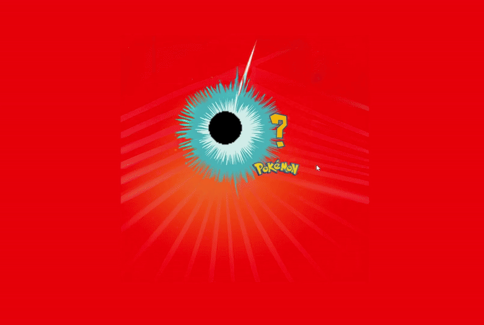

En utilisant une api Pokémon de votre choix, reproduisez le fameux “who’s that pokemon”

https://drive.google.com/drive/folders/1key8wSpF3C71ObG9uxpjJPIgEMkm_mOn?usp=share_link

Ouverture de la modale après 3 secondes d’affichage

BONUS: Jouer les sons
